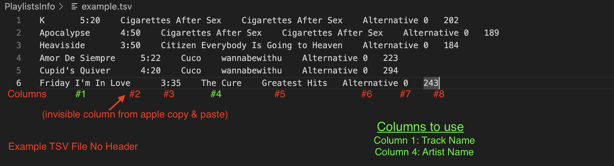
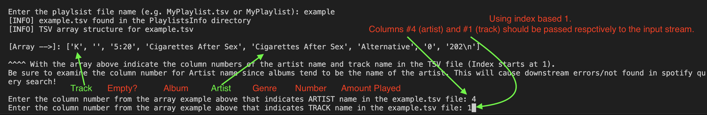

# A2S
Free, interactive and lightweight python script to help migrate apple/audio TSV playlist to Spotify. Requests and saves token authentication (locally) and checks for duplicate tracks before inserting.

## Requirements
1. A Spotify Account
   1. Create a Spotify Developer account with your regular Spotify account.
   2. [Click here to visit Spotify Developer](https://developer.spotify.com/)
   3. Visit the "Dashboard" section and click "Create app"
   4. Name the title and add any description **but** use the same Redirect URI and API/SDKs. Then click "Save".
      
2. Python installation.
   1. [Download Python](https://www.python.org/downloads/)
   2. Program was run on version 3.12.2
3. A TSV of your playlist with at minimum the Artist name and the Song name as columns.
   1. Since this program is intended to migrate an Apple playlist to Spotify, I will use the ***Desktop*** Apple Music application to readily obtain the TSV of the data needed.
   2. Sign into Apple Music.
        
   3. Signing in should prompt a syncing of library music/playlist from your phone.
      - If not you can go to Music (Top left) > Settings. Make sure the "Sync Library" option is toggled. Quit the application and reopen.
        
   4. With your playlist(s) synced, click the playlist, then click the first song and then select all tracks in the playlist with the short cut keys (CMD + A or Ctrl + A)
        
   5. Open a text editor or blank file in Notepad etc, paste the TSV and save it. You should see something like this if you followed the above steps. The red boxes from left to right are: the song name, and the artist name. Which is the minimum criteria needed in our TSV dump.
        

## TSV Format Expectation
Since the software requires a TSV to process for adding songs to a Spotify playlist. The following format is required:
1. No header columns in TSV (i.e. Field names: ARTIST, SONG_NAME, etc.)
2. Track Name Column
3. Artist Name Column

**Column Numbers will be specified by index based 1 into the stream!** 

(i.e. DON'T start with 0. The program will handle the index during execution)

Example below of how a TSV was saved into the "PlaylistsInfo" directory for the columns used in the input section when extracting the columns needed for the data structure in API request.


When parsing the TSV in the software, an example array will be outputted to the console based on the TSV input to allow the user to see what columns are needed. Using the screenshot above as reference, you can see that columns #1 and # 4 are used (for some reason there is an empty tab column when I pasted from Apple Music, hence skip the 2nd column).

You'll pretty much specify these in the input section as seen below.


## Running the Program
1. Be logged into Spofity in your Web browser executing the script.
2. Have the playlist created in Spotify.
3. Obtain a TSV of the songs you want to add to your spotify playlist. **2 Minimum fields needed are the Artist Name & Track Name**. Save this into the "PlaylistsInfo" directory of this project as a TSV file.
   1. See Step # 3 in the Requirements for getting a TSV from the desktop application for Apple Music.
4. Run ```python3 main.py``` in this project directory.
   1. Alternatively you can pass the --debug flag to record a txt file of the output stream of your interaction. ```python3 main.py --debug```
5. **Follow the console/output stream for instructions/directions!** 
   1. There will be some user input needed as the script progresses.
6. Disclaimer message will appear stating that you've met the requirements in order for the software to function as intended.
7. Then you'll be presented with a couple of options:
   1. **For running the program for the very 1st time**, you can choose option #1 to create the token json, fetch a credential token, and process the TSV to add to your spotify playlist.
   2. For subsequent uses, you'll most likely need to use option 3 after 1 hour since the token that Spotify provides is only valid for 1 hour. Option 4 can be used anytime when the token is valid.
8. Follow the prompts in the output stream to obtain the ```?code=``` param in the localhost URL when retreiving the access token credential.
   1. Probably best if you paste this into some sort of editor to easily extract the string value after ```?code=```. E.g. below
   
9. Then when prompted, you'll enter the name of your TSV playlist file that was saved in "PlaylistsInfo".
   
   
10. Then when prompted, you'll enter the name of your playlist ID.
    1. You can find this after the ```/playlist/``` in the URL. Example below
   
11. If all goes well, songs will be inserted into playlists.
    1.  With the exception of songs that are already present in the playlist to avoid duplicates. This however should be indicated in the output stream.
12. Any issues with the software like network requests, invalid tokens should be logged into the output stream.